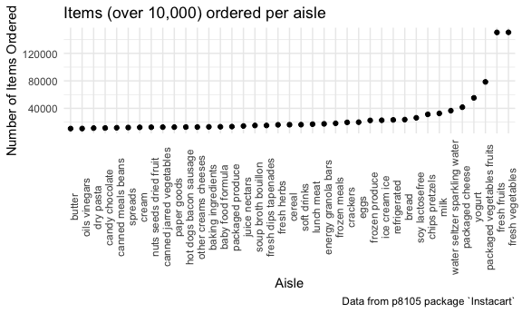
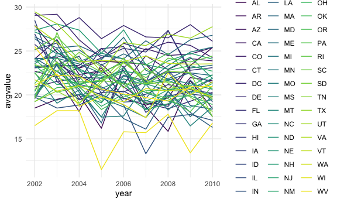
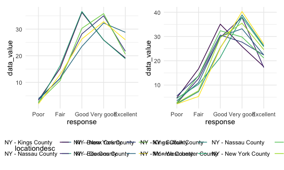
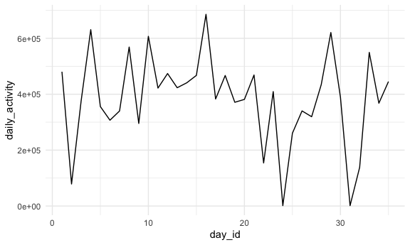

HW3
================

``` r
library(tidyverse)
library(p8105.datasets)
library(patchwork)

knitr::opts_chunk$set(
  fig.width = 6,
  fig.asp = .6,
  out.width = "90%"
)

theme_set(theme_minimal() + theme(legend.position = "bottom"))

options(
  ggplot2.continuous.colour = "viridis",
  ggplot2.continuous.fill = "viridis"
)

scale_colour_discrete = scale_colour_viridis_d
scale_fill_discrete = scale_fill_viridis_d
```

## Problem 1

``` r
data("instacart") 
instacart
```

    ## # A tibble: 1,384,617 × 15
    ##    order_id product_id add_to_cart_order reordered user_id eval_set order_number
    ##       <int>      <int>             <int>     <int>   <int> <chr>           <int>
    ##  1        1      49302                 1         1  112108 train               4
    ##  2        1      11109                 2         1  112108 train               4
    ##  3        1      10246                 3         0  112108 train               4
    ##  4        1      49683                 4         0  112108 train               4
    ##  5        1      43633                 5         1  112108 train               4
    ##  6        1      13176                 6         0  112108 train               4
    ##  7        1      47209                 7         0  112108 train               4
    ##  8        1      22035                 8         1  112108 train               4
    ##  9       36      39612                 1         0   79431 train              23
    ## 10       36      19660                 2         1   79431 train              23
    ## # … with 1,384,607 more rows, and 8 more variables: order_dow <int>,
    ## #   order_hour_of_day <int>, days_since_prior_order <int>, product_name <chr>,
    ## #   aisle_id <int>, department_id <int>, aisle <chr>, department <chr>

``` r
instacart %>% 
  group_by(order_id) %>% 
  summarize(n_obs = n()) 
```

    ## # A tibble: 131,209 × 2
    ##    order_id n_obs
    ##       <int> <int>
    ##  1        1     8
    ##  2       36     8
    ##  3       38     9
    ##  4       96     7
    ##  5       98    49
    ##  6      112    11
    ##  7      170    17
    ##  8      218     5
    ##  9      226    13
    ## 10      349    11
    ## # … with 131,199 more rows

``` r
instacart %>% 
  count(aisle_id)
```

    ## # A tibble: 134 × 2
    ##    aisle_id     n
    ##       <int> <int>
    ##  1        1  2936
    ##  2        2  3873
    ##  3        3 17449
    ##  4        4  9917
    ##  5        5  2905
    ##  6        6  1795
    ##  7        7  1526
    ##  8        8  1501
    ##  9        9  9736
    ## 10       10   448
    ## # … with 124 more rows

The `instacart` dataset has 15 variables and 1384617 observations. Each
observation is an item added to an Instacart order. The dataset
describes those orders in terms of which items had been previously
ordered by ths customer (`reordered`), what order they were added to the
cart (`add_to_cart_order`), and additional product details
(`product id`, `product_name`, `aisle`, and `department`). For example,
we know that for the first order (`order_id` = 1), customer 112108
placed their 4th order 9 days after their prior order. they ordered 8
items.

``` r
instacart %>% 
  group_by(aisle_id) %>% 
  summarize (n_obs = n()) %>% 
  arrange(desc(n_obs))
```

    ## # A tibble: 134 × 2
    ##    aisle_id  n_obs
    ##       <int>  <int>
    ##  1       83 150609
    ##  2       24 150473
    ##  3      123  78493
    ##  4      120  55240
    ##  5       21  41699
    ##  6      115  36617
    ##  7       84  32644
    ##  8      107  31269
    ##  9       91  26240
    ## 10      112  23635
    ## # … with 124 more rows

There are 134 aisles in this dataset and aisles 83 (fresh vegetables)
and 24 (fresh fruits) have the most items ordered from them with over
150,000 items per aisle.

``` r
instacart %>% 
  group_by(aisle_id) %>% 
  summarize (n_obs = n()) %>% 
  filter(n_obs > 10000) %>% 
  mutate(aisle_id = fct_reorder(as.factor(aisle_id), n_obs)) %>% 
  arrange(desc(n_obs)) %>% 
  ggplot(aes(x = aisle_id, y = n_obs)) +
  geom_point() + 
  labs(
    title = "Items (over 10,000) ordered per aisle", 
    x = "Aisle Number", 
    y = "Number of Items Ordered", 
    caption = "Data from p8105 package `Instacart`"
  ) 
```



## HOW TO FIX SCALE

``` r
instacart %>% 
  filter(aisle %in% c("baking ingredients", "dog food care", "packaged vegetables fruits")) %>% 
  select(aisle, product_name) %>% 
  group_by(aisle, product_name) %>% 
  summarize(number_ordered = n()) %>% 
  filter(number_ordered == max(number_ordered)) %>% 
  arrange(desc(number_ordered)) %>% 
  knitr::kable(caption = "Most popular products in selected aisles")
```

| aisle                      | product\_name                                 | number\_ordered |
|:---------------------------|:----------------------------------------------|----------------:|
| packaged vegetables fruits | Organic Baby Spinach                          |            9784 |
| baking ingredients         | Light Brown Sugar                             |             499 |
| dog food care              | Snack Sticks Chicken & Rice Recipe Dog Treats |              30 |

Most popular products in selected aisles

``` r
instacart %>% 
  filter(product_name %in% c("Pink Lady Apples", "Coffee Ice Cream")) %>% 
  select(product_name, order_dow, order_hour_of_day) %>% 
  group_by(product_name, order_dow) %>% 
  summarize(mean_hour = mean(order_hour_of_day)) %>% 
  pivot_wider(names_from = order_dow, values_from = mean_hour) %>% 
  rename("Sunday" = "0", "Monday" = "1", "Tuesday" = "2", "Wednesday" = "3", "Thursday" = "4", "Friday" = "5", "Saturday" = "6") %>% 
  knitr::kable(caption = "Mean hour of the day select items are ordered")
```

| product\_name    |   Sunday |   Monday |  Tuesday | Wednesday | Thursday |   Friday | Saturday |
|:-----------------|---------:|---------:|---------:|----------:|---------:|---------:|---------:|
| Coffee Ice Cream | 13.77419 | 14.31579 | 15.38095 |  15.31818 | 15.21739 | 12.26316 | 13.83333 |
| Pink Lady Apples | 13.44118 | 11.36000 | 11.70213 |  14.25000 | 11.55172 | 12.78431 | 11.93750 |

Mean hour of the day select items are ordered

## Problem 2

``` r
data("brfss_smart2010") 
brfss_smart2010
```

    ## # A tibble: 134,203 × 23
    ##     Year Locationabbr Locationdesc  Class  Topic Question   Response Sample_Size
    ##    <int> <chr>        <chr>         <chr>  <chr> <chr>      <chr>          <int>
    ##  1  2010 AL           AL - Jeffers… Healt… Over… How is yo… Excelle…          94
    ##  2  2010 AL           AL - Jeffers… Healt… Over… How is yo… Very go…         148
    ##  3  2010 AL           AL - Jeffers… Healt… Over… How is yo… Good             208
    ##  4  2010 AL           AL - Jeffers… Healt… Over… How is yo… Fair             107
    ##  5  2010 AL           AL - Jeffers… Healt… Over… How is yo… Poor              45
    ##  6  2010 AL           AL - Jeffers… Healt… Fair… Health St… Good or…         450
    ##  7  2010 AL           AL - Jeffers… Healt… Fair… Health St… Fair or…         152
    ##  8  2010 AL           AL - Jeffers… Healt… Heal… Do you ha… Yes              524
    ##  9  2010 AL           AL - Jeffers… Healt… Heal… Do you ha… No                77
    ## 10  2010 AL           AL - Jeffers… Healt… Unde… Adults ag… Yes              316
    ## # … with 134,193 more rows, and 15 more variables: Data_value <dbl>,
    ## #   Confidence_limit_Low <dbl>, Confidence_limit_High <dbl>,
    ## #   Display_order <int>, Data_value_unit <chr>, Data_value_type <chr>,
    ## #   Data_Value_Footnote_Symbol <chr>, Data_Value_Footnote <chr>,
    ## #   DataSource <chr>, ClassId <chr>, TopicId <chr>, LocationID <chr>,
    ## #   QuestionID <chr>, RESPID <chr>, GeoLocation <chr>

``` r
brfss = brfss_smart2010 %>% 
  janitor::clean_names() %>% 
  filter(topic == "Overall Health") %>% 
  mutate(response = as.factor(response), response = factor(response, levels = c("Poor", "Fair", "Good", "Very good", "Excellent")))
```

``` r
brfss %>% 
  filter(year == 2002) %>% 
  group_by(locationabbr, locationdesc) %>% 
  summarise(n_obs = n()) %>% 
  count(locationabbr) %>% 
  filter(n >= 7) %>% 
  arrange(n)
```

    ## `summarise()` has grouped output by 'locationabbr'. You can override using the `.groups` argument.

    ## # A tibble: 6 × 2
    ## # Groups:   locationabbr [6]
    ##   locationabbr     n
    ##   <chr>        <int>
    ## 1 CT               7
    ## 2 FL               7
    ## 3 NC               7
    ## 4 MA               8
    ## 5 NJ               8
    ## 6 PA              10

In 2002, Connecticut, Florida, and North Carolina were each observed at
7 locations, Massachusetts and New Jersey were observed at 8 locations,
and Pennsylvania was observed at 10 locations.

``` r
brfss %>% 
  filter(year == 2010) %>% 
  group_by(locationabbr, locationdesc) %>% 
  summarise(n_obs = n()) %>% 
  count(locationabbr) %>% 
  filter(n >= 7) %>% 
  arrange(n)
```

    ## `summarise()` has grouped output by 'locationabbr'. You can override using the `.groups` argument.

    ## # A tibble: 14 × 2
    ## # Groups:   locationabbr [14]
    ##    locationabbr     n
    ##    <chr>        <int>
    ##  1 CO               7
    ##  2 PA               7
    ##  3 SC               7
    ##  4 OH               8
    ##  5 MA               9
    ##  6 NY               9
    ##  7 NE              10
    ##  8 WA              10
    ##  9 CA              12
    ## 10 MD              12
    ## 11 NC              12
    ## 12 TX              16
    ## 13 NJ              19
    ## 14 FL              41

In 2010, the following states were observed at the following number of
locations: \* 7 locations: Colorado, Pennsylvania, and South Carolina \*
8 locations: Ohio \* 9 locations: Massachusetts and New York \* 10
locations: Nebraska and Washington \* 12 locations: California,
Maryland, and North Carolina \* 16 locations: Texas \* 19 locations: New
Jersey \* 41 locations: Florida

``` r
spaghetti = brfss %>% 
  filter(response == "Excellent") %>% 
  group_by(year, locationabbr) %>% 
  summarize(avgvalue = mean(data_value))
```

    ## `summarise()` has grouped output by 'year'. You can override using the `.groups` argument.

``` r
spaghetti %>% 
  ggplot(aes(x = year, y = avgvalue, group = locationabbr, color = locationabbr)) + 
  geom_line() 
```

    ## Warning: Removed 3 row(s) containing missing values (geom_path).



``` r
nys2006 = brfss %>% 
  filter(year == 2006, locationabbr == "NY") %>% 
  group_by(locationdesc, response) 

nys2010 = brfss %>% 
  filter(year == 2010, locationabbr == "NY") %>% 
  group_by(locationdesc, response) 

nys2006_plot = nys2006 %>% 
  ggplot(aes(x = response, y = data_value, group = locationdesc, color = locationdesc)) + 
  geom_line()

nys2010_plot = nys2010 %>% 
  ggplot(aes(x = response, y = data_value, group = locationdesc, color = locationdesc)) + 
  geom_line()

(nys2006_plot + nys2010_plot)
```



## Problem 3

``` r
accel_df = read_csv("data/accel_data.csv") %>% 
  janitor::clean_names() %>% 
  mutate (weekday_weekend = ifelse(day %in% c("Sunday", "Saturday"), "weekend", "weekday")) %>% 
  pivot_longer(activity_1:activity_1440, names_to = "minute", names_prefix = "activity_", values_to = "activity_count") %>% 
  mutate(minute = as.numeric(minute)) 
```

    ## Rows: 35 Columns: 1443

    ## ── Column specification ────────────────────────────────────────────────────────
    ## Delimiter: ","
    ## chr    (1): day
    ## dbl (1442): week, day_id, activity.1, activity.2, activity.3, activity.4, ac...

    ## 
    ## ℹ Use `spec()` to retrieve the full column specification for this data.
    ## ℹ Specify the column types or set `show_col_types = FALSE` to quiet this message.

The `accel_df` dataset has 50400 observations, which each represent the
activity count for a single minute of a single day for the 63 year-old
male over a 5 week period. The dataset has 6 variables, which include
the `minute` of the given day and the associated `activity_count` for
that minute, the number of the `week` out of 5, the `day_id`, the `day`
of the week, and the `weekday_weekend` variable, which notes if the
specified day is a weekday or a weekend.

``` r
accel_df %>% 
  group_by(day_id) %>% 
  summarize(daily_activity = sum(activity_count)) %>% 
  ggplot(aes(x= day_id, y = daily_activity)) + 
  geom_line()
```


